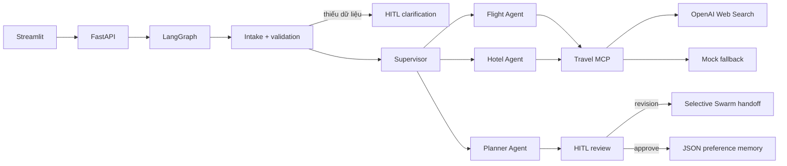

# Agentic Travel Planner

Capstone trợ lý lập kế hoạch du lịch bằng FastAPI, LangGraph, MCP và Streamlit. Project có một mode duy nhất, nhưng thể hiện đủ Hierarchical Supervisor, specialist agents, tool calling qua MCP, HITL, memory và Swarm-style handoff khi chỉnh sửa.

## Điểm chính

- FastAPI là backend duy nhất; Streamlit chỉ gọi API.
- Supervisor điều phối `Flight Agent → Hotel Agent → Planner Agent`.
- Hai điểm HITL: bổ sung constraint còn thiếu và duyệt/chỉnh kế hoạch.
- Revision chỉ chạy lại dữ liệu bị ảnh hưởng. Ví dụ đổi hotel và giữ flight thì không search flight lại.
- MCP server độc lập cung cấp `search_flights` và `search_hotels`.
- Live search dùng OpenAI Responses Web Search, không cần Tavily.
- Khi live search lỗi hoặc thiếu nguồn, toàn bộ response đó chuyển sang mock; không trộn web/mock trong cùng response.
- Giá và ngân sách là VND; budget được tính bằng code, không giao cho LLM cộng số.
- Không booking, thanh toán hay giữ chỗ.

## Kiến trúc



## Cấu trúc chính

```text
app/
  agents/           # supervisor, flight/hotel specialists, planner
  mcp/              # stdio MCP server/client và live/mock providers
  memory/           # preference memory dạng JSON
  services/         # LLM extraction, budget, validation, constraint patch
  api.py             # start/resume/status endpoints
  graph.py           # toàn bộ LangGraph + HITL + Swarm handoff
  main.py            # FastAPI entrypoint
ui/streamlit_app.py  # frontend mỏng
data/                # canonical mock datasets
tests/               # unit + workflow integration tests
SPEC.md              # scope/design đã chốt
```

## Cài đặt trên Windows

```powershell
cd D:\UNI_STUDY\Year3\Semester3\LLMEngineer\Module2\agentic-travel-planner
python -m venv .venv
.\.venv\Scripts\Activate.ps1
python -m pip install -r requirements.txt
Copy-Item .env.example .env
```

Trong `.env`:

```dotenv
OPENAI_API_KEYS=sk-...
LLM_MODEL=gpt-5.4-mini
WEB_SEARCH_MODEL=gpt-5.4-mini
USE_MOCK_LLM=false
USE_MOCK_TRAVEL_DATA=false
```

Không có key project vẫn chạy bằng heuristic + mock fallback. Để demo offline hoàn toàn và không phát sinh phí:

```dotenv
USE_MOCK_LLM=true
USE_MOCK_TRAVEL_DATA=true
```

## Chạy

Terminal 1:

```powershell
.\.venv\Scripts\Activate.ps1
python -m uvicorn app.main:app --reload --host 127.0.0.1 --port 8000
```

Terminal 2:

```powershell
.\.venv\Scripts\Activate.ps1
python -m streamlit run ui/streamlit_app.py --server.address 127.0.0.1 --server.port 8501
```

Mở:

- UI: <http://127.0.0.1:8501>
- Swagger: <http://127.0.0.1:8000/docs>
- Health: <http://127.0.0.1:8000/health>

## Test qua Swagger/FastAPI

1. `POST /api/trips/start`:

```json
{
  "message": "Đi từ TP.HCM đến Đà Nẵng từ 2027-01-15 đến 2027-01-18, 2 người, ngân sách 20 triệu VND, thích biển và ẩm thực.",
  "user_id": "demo-user"
}
```

2. Lấy `thread_id`, rồi gọi `POST /api/trips/{thread_id}/resume`:

```json
{
  "action": "revise",
  "message": "Đổi khách sạn dưới 1,5 triệu/đêm, giữ nguyên chuyến bay."
}
```

3. Duyệt kết quả:

```json
{
  "action": "approve",
  "message": ""
}
```

## Chạy test

```powershell
python -m pytest -q
```

Test luôn ép mock nên không gọi OpenAI và không phát sinh phí.

## Provenance và giới hạn

Mỗi flight/hotel có `source`, `source_url`, `observed_at`, `is_estimate`. Chỉ kết quả đi qua Web Search thật và khớp URL nguồn mới được gắn `source="web"`; còn lại là `source="mock"` kèm warning. Project là demo recommendation, không phải hệ thống giá/availability hoặc booking production.
