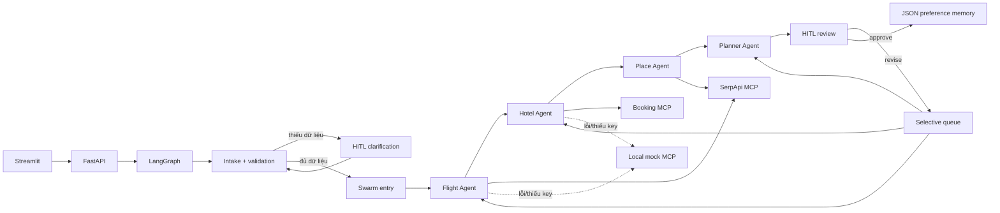

# Agentic Travel Planner

Capstone trợ lý lập kế hoạch du lịch bằng FastAPI, LangGraph, MCP và Streamlit. Project có
một mode duy nhất và đi thẳng vào Swarm: Flight, Hotel, Place và Planner Agent tự
handoff cho nhau cho cả plan đầu tiên lẫn revision.

Tài liệu đọc code và debug chi tiết: [`DEVELOPER_GUIDE.md`](DEVELOPER_GUIDE.md).

**Học product và LLMOps:** mở [`docs/LEARN_THE_REPO.html`](docs/LEARN_THE_REPO.html)
bằng trình duyệt: bản đồ code, sơ đồ agent tương tác, prompt versioning, Langfuse,
token/cost calculator, hướng dẫn debug và bài thực hành. HTML đọc offline, không cần server.

## Điểm chính

- FastAPI là backend duy nhất; Streamlit chỉ gọi API.
- Streamlit giữ nguyên lịch sử chat và từng phiên bản plan; yêu cầu chỉnh sửa và plan mới được nối
  tiếp ở cuối timeline.
- Không có Supervisor/Hierarchical layer.
- Hai điểm HITL: bổ sung constraint còn thiếu và duyệt/chỉnh kế hoạch.
- Revision chỉ chạy lại agent bị ảnh hưởng. Đổi hotel và giữ flight sẽ không search flight.
- Flight thật: Google Flights qua hosted MCP chính thức của SerpApi.
- Hotel thật: Booking.com qua Flightpowers Booking MCP connector được liệt kê trên Glama.
- Địa điểm thật: Google Maps qua chính SerpApi MCP, gồm địa chỉ/rating/số review.
- Vé hiển thị đủ chiều đi/về; hotel chọn riêng cho từng đêm; mọi nhóm chi phí có line item.
- Thiếu key hoặc provider lỗi: fallback cả response sang local MCP mock, không trộn dữ liệu.
- Hotel detail chỉ được tra lại khi người dùng bấm xem; flight booking options được giữ ở API
  read-only để kiểm tra qua Swagger hoặc tích hợp khác.
- App không tự gửi form đặt vé, không booking, thanh toán hay giữ chỗ.
- Budget VND được tính bằng code, không giao cho LLM cộng số.
- Prompt YAML có version/labels trong Git, tùy chọn lấy từ Langfuse; fallback local khi Cloud lỗi.
- UI nhận tiến độ node/tool thật qua SSE, hiển thị thời gian, token, phí LLM và trace link.
- Mỗi lượt start/resume có telemetry riêng; các lượt cùng chuyến đi được gom theo thread/session.

## Kiến trúc



`swarm_entry` chỉ tạo queue kỹ thuật, không phải một agent quản lý. Mỗi specialist hoàn tất
xong sẽ trả `Command(goto=...)` để handoff thẳng đến agent kế tiếp.

## Cấu trúc chính

```text
app/
  agents/
    specialists.py       # Flight/Hotel/Place search + deterministic ranking
    planner.py            # chọn evidence, itinerary, budget
  mcp/
    client.py             # 3 MCP connections: serpapi, booking, local mock
    server.py             # local stdio MCP fallback
    providers/
      serpapi.py          # Google Flights + Google Maps + booking options
      booking.py          # Booking tool params + normalization + hotel lookup
      mock.py             # deterministic local data
      service.py          # live-first/fallback facade
  memory/store.py         # preference memory dạng JSON
  services/               # LLM extraction, validation, revision patch, budget
  api.py                   # workflow + on-demand detail endpoints
  graph.py                 # Swarm graph + HITL
  main.py                  # FastAPI entrypoint
ui/streamlit_app.py        # frontend mỏng
data/                      # mock datasets
tests/                     # unit + workflow integration tests
SPEC.md                    # scope/design chuẩn hiện tại
```

## Cài đặt trên Windows

```powershell
cd D:\UNI_STUDY\Year3\Semester3\LLMEngineer\Module2\agentic-travel-planner
python -m venv .venv
.\.venv\Scripts\Activate.ps1
python -m pip install -r requirements.txt
Copy-Item .env.example .env
```

### Chế độ offline, không phát sinh phí

```dotenv
USE_MOCK_LLM=true
USE_MOCK_TRAVEL_DATA=true
```

### Chế độ live

```dotenv
OPENAI_API_KEYS=your-openai-key
USE_MOCK_LLM=false
LLM_MAX_COMPLETION_TOKENS=3200

USE_MOCK_TRAVEL_DATA=false
SERPAPI_API_KEY=your-serpapi-key
SERPAPI_MCP_URL=https://mcp.serpapi.com/mcp

BOOKING_MCP_URL=https://hotels.flightpowers.com/mcp
RAPIDAPI_KEY=your-rapidapi-key
```

- OpenAI chỉ dùng cho parse request/revision và viết itinerary.
- Nếu itinerary structured output bị cắt vì quá dài, Planner tự chuyển sang fallback an toàn
  thay vì làm dừng workflow.
- SerpApi key dùng cho flight search/booking options và Google Maps place search.
- RapidAPI key dùng cho Flightpowers Booking MCP ad-free. Cần subscribe Booking Live API
  của publisher trước khi gọi.
- Nếu bạn thêm connector qua Glama Gateway, thay `BOOKING_MCP_URL` bằng URL Glama cấp.
  Gateway có thể quản lý credential nên `RAPIDAPI_KEY` có thể để trống.
- Không có key thì project vẫn chạy: heuristic LLM fallback + travel mock fallback.

## Chạy BE và FE

Terminal 1:

```powershell
.\.venv\Scripts\Activate.ps1
python -m uvicorn app.main:app --reload --host 127.0.0.1 --port 8000
```

Terminal 2:

```powershell
.\.venv\Scripts\Activate.ps1
python -m streamlit run ui/streamlit_app.py --server.address 127.0.0.1 --server.port 8501
```

Mở UI tại <http://127.0.0.1:8501>, Swagger tại <http://127.0.0.1:8000/docs> và health
tại <http://127.0.0.1:8000/health>.

## API chính

| Method | Endpoint | Mục đích |
|---|---|---|
| `POST` | `/api/trips/start` | Tạo thread và chạy tới HITL đầu tiên. |
| `POST` | `/api/trips/start/stream` | Start với SSE progress/result/error. |
| `POST` | `/api/trips/{thread_id}/resume` | Trả lời clarification hoặc approve/revise. |
| `POST` | `/api/trips/{thread_id}/resume/stream` | Resume với tiến độ SSE. |
| `GET` | `/api/trips/{thread_id}` | Xem snapshot hiện tại. |
| `POST` | `/api/trips/{thread_id}/flight-booking-options` | Tra seller của một flight, read-only. |
| `POST` | `/api/trips/{thread_id}/hotel-details` | Tra lại một hotel theo tên, read-only. |

Body của hai endpoint on-demand:

```json
{"option_id": "SF1"}
```

Với round trip, planning dùng một call ban đầu và một call lấy các lựa chọn chiều về cho
chuyến đi được xếp hạng cao nhất. UI cho chọn combo đi–về; giá từng chiều chỉ hiện khi provider
thật sự tách giá. Nếu seller yêu cầu `POST` form, app không trả form data và không tự submit.

## Test và log BE

```powershell
python -m ruff check app ui scripts tests
python -m pytest -q
```

Tests luôn ép mock nên không gọi OpenAI, SerpApi hay Booking.
Tests Langfuse dùng in-memory exporter và fake credentials, không gọi Cloud.

Log backend nằm ngay terminal chạy Uvicorn. Muốn nhiều chi tiết hơn:

```powershell
python -m uvicorn app.main:app --reload --host 127.0.0.1 --port 8000 --log-level debug
```

Trong UI mở `Agent trace & metrics` để xem node, tool, handoff, số MCP call và số external
search call. Không log key hay raw provider payload.

## Prompt management và Langfuse Cloud

Mặc định `PROMPT_BACKEND=local`, `LANGFUSE_ENABLED=false`: prompt và metrics local hoạt động
không cần Cloud. Prompt artifacts ở `prompts/`; `production.txt`/`staging.txt` là alias.
Planner v1 đang production, v2 là staging candidate **chưa được đánh giá live**.

Bạn tạo project Langfuse Cloud rồi thêm vào `.env` hiện có (không copy đè `.env`):

```dotenv
LANGFUSE_PUBLIC_KEY=pk-lf-your-project-key
LANGFUSE_SECRET_KEY=sk-lf-your-project-key
LANGFUSE_BASE_URL=https://cloud.langfuse.com
LANGFUSE_ENABLED=true
TELEMETRY_CAPTURE_CONTENT=false
PROMPT_BACKEND=local
PROMPT_LABEL=production
```

Base URL phải đúng region của project. Sau khi cài lại `requirements.txt`:

```powershell
python -m scripts.check_langfuse
python -m scripts.publish_prompts
python -m scripts.publish_prompts --apply --promote
```

Lệnh đầu kiểm tra auth; lệnh thứ hai chỉ validate/dry-run; lệnh cuối **upload prompts và đồng bộ
labels từ repo lên Cloud**, không gọi OpenAI. Sau đó đặt `PROMPT_BACKEND=langfuse`, restart BE.
Nếu chỉ muốn tracing, giữ backend prompt `local`.

- Version đã publish không sửa đè; tạo `vN.yaml` mới, test rồi promote/rollback label.
- Remote version và local artifact version có thể khác số; metadata giữ cả hai.
- Prompt được pin trong mỗi run; cache Cloud có TTL mặc định 60 giây.
- `python -m scripts.compare_prompts` chỉ diff offline. Thêm `--live` mới gọi tối đa **2 LLM calls**
  trên một fixture, không gọi travel APIs; không phải benchmark đầy đủ.
- `PROMPT_AB_ENABLED` mặc định false; bật mới chia sticky prod-a/prod-b theo user_id cho planner.
- Usage lấy từ response, cached tokens không tính trùng. Thiếu usage/đơn giá thì cost chưa xác định,
  không giả thành $0. `LLM_PRICES_JSON` override giá USD/million tokens.
- Chi phí này chỉ của LLM, không gồm SerpApi/RapidAPI/hosting và không phải ngân sách du lịch VND.
- `TELEMETRY_CAPTURE_CONTENT=false` không gửi nội dung compiled prompt/output lên trace;
  bật true là chủ động cho phép gửi nội dung. Publish templates vẫn upload template tĩnh.

Trong UI, mục **Hoạt động của trợ lý** hiển thị metrics của lượt vừa rồi, history các lượt và
link Langfuse khi có. Node HITL chờ duyệt không bị tính là lỗi. SSE hiện tiến độ workflow,
không stream từng token model. HTTP 200 mở stream chưa đảm bảo thành công: đọc terminal result/error.

Giới hạn demo: checkpoint/run history/lock nằm trong RAM một process; restart BE làm thread cũ
có thể 404. Chưa có durable replay, auth, multi-worker lock hoặc auto quality scoring.
Hủy stream không đảm bảo hủy được HTTP LLM sync đang chạy; usage khi hủy có thể chưa đầy đủ.
Cloud chưa được xác thực nếu bạn chưa thêm credentials; local tests không chứng minh Cloud đã nhận trace.

## Nguồn và giới hạn

- SerpApi flight/place trả `source="serpapi"`; Booking hotel trả `source="booking"`.
- Fallback trả `source="mock"` kèm warning.
- `observed_at` ghi thời điểm thu thập; giá chỉ là snapshot, không được giữ.
- Hotel rates có thể đổi trong vài phút; on-demand detail luôn search lại.
- Đây là demo recommendation, không phải booking engine production.

Tài liệu provider:

- [SerpApi Google Flights API](https://serpapi.com/google-flights-api)
- [SerpApi booking options](https://serpapi.com/google-flights-booking-options)
- [SerpApi MCP server](https://github.com/serpapi/serpapi-mcp)
- [SerpApi Google Maps local results](https://serpapi.com/maps-local-results)
- [Flightpowers Booking connector trên Glama](https://glama.ai/mcp/connectors/com.flightpowers/booking)
- [Flightpowers travel-agent-skills](https://github.com/mtnrabi/travel-agent-skills)
