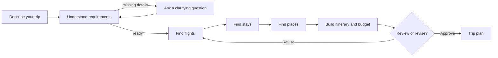

# ✈️ Agentic Travel Planner

An AI travel assistant that turns a natural-language request into a reviewable trip plan: flights, accommodation, places, day-by-day itinerary, and a transparent budget.

You stay in control. Compare options, revise a constraint, keep the parts you like, and let the planner refresh only the affected part of the trip.

## Highlights

- Vietnamese conversational trip planning with clarification only when needed.
- Outbound/return flight options, hotel choices per night, and place recommendations with map links when available.
- A detailed VND budget for flights, stays, food, activities, local transport, and contingency.
- Selective replanning: changing hotels does not need to re-search flights.
- A live **Assistant Activity** tab for agent progress, time, LLM tokens, estimated cost, and optional Langfuse traces.

## How it works



## Data sources

| Need | Preferred source | Safe fallback |
|---|---|---|
| Flights and places | Google Flights / Google Maps via SerpApi MCP | Clearly labelled `mock` data |
| Hotels | Booking.com via Flightpowers Booking MCP | Clearly labelled `mock` data |
| Request understanding and itinerary | OpenAI structured output | Deterministic heuristic fallback |

Live and mock evidence are never silently mixed. If a provider fails or a key is missing, the UI marks the fallback source.

## Quick start

### 1. Install

```powershell
cd D:\UNI_STUDY\Year3\Semester3\LLMEngineer\Module2\agentic-travel-planner
python -m venv .venv
.\.venv\Scripts\Activate.ps1
python -m pip install -r requirements.txt
Copy-Item .env.example .env
```

### 2. Choose a mode

**Offline demo — no model or search cost**

```dotenv
USE_MOCK_LLM=true
USE_MOCK_TRAVEL_DATA=true
```

**Live AI and search — add your keys to `.env`**

```dotenv
OPENAI_API_KEYS=your-openai-key
USE_MOCK_LLM=false
LLM_MAX_COMPLETION_TOKENS=3200

USE_MOCK_TRAVEL_DATA=false
SERPAPI_API_KEY=your-serpapi-key
SERPAPI_MCP_URL=https://mcp.serpapi.com/mcp

BOOKING_MCP_URL=https://hotels.flightpowers.com/mcp
RAPIDAPI_KEY=your-rapidapi-key
```

Never commit `.env` or API keys. A missing provider does not stop the app; it falls back to labelled mock data.

### 3. Start backend and frontend

Terminal 1 — FastAPI backend:

```powershell
.\.venv\Scripts\Activate.ps1
python -m uvicorn app.main:app --reload --host 127.0.0.1 --port 8000
```

Terminal 2 — Streamlit frontend:

```powershell
.\.venv\Scripts\Activate.ps1
python -m streamlit run ui/streamlit_app.py --server.address 127.0.0.1 --server.port 8501
```

Open the app at <http://127.0.0.1:8501>. API documentation is available at <http://127.0.0.1:8000/docs>.

## Notes

- Prices are provider snapshots and may change before checkout.
- This is a planning assistant, not a booking service: it does not pay, sign in, submit booking forms, or hold inventory.
- Travel budget (VND) and LLM operating cost (USD) are intentionally shown separately.
- Langfuse tracing is optional. By default, prompt and output content are not exported (`TELEMETRY_CAPTURE_CONTENT=false`).
- Trip state is in-memory for this demo; start a new trip after restarting the backend.

## Built with

`Streamlit` · `FastAPI` · `LangGraph` · `MCP` · `OpenAI` · `SerpApi` · `Booking.com connector` · `Langfuse`

---

Built as an LLM Engineering capstone focused on transparent, reviewable travel planning rather than autonomous booking.
