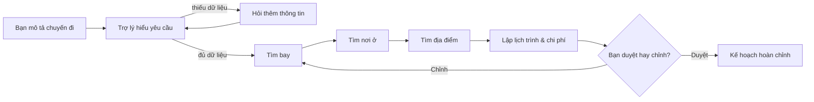

# ✈️ Agentic Travel Planner

> Một trợ lý du lịch hội thoại: hiểu điều bạn cần, tìm các lựa chọn phù hợp và cùng bạn hoàn thiện một kế hoạch có thể thực hiện.

**Agentic Travel Planner** biến một yêu cầu như “đi Đà Nẵng 3 ngày, 2 người, thích biển và ẩm thực, ngân sách 20 triệu” thành một kế hoạch rõ ràng: chuyến bay, khách sạn, địa điểm, lịch trình từng ngày và bảng chi phí minh bạch.

Người dùng luôn là người quyết định. Bạn có thể xem lựa chọn, chỉnh điều kiện, giữ lại phần mình thích và yêu cầu trợ lý lập lại đúng phần bị ảnh hưởng.

## Bạn có thể làm gì?

- **Nói chuyện tự nhiên bằng tiếng Việt** — trợ lý chỉ hỏi lại khi thiếu thông tin quan trọng.
- **So sánh chuyến bay rõ ràng** — xem chiều đi/về, giờ bay, hãng, giá và lựa chọn bán vé khi dữ liệu có sẵn.
- **Chọn nơi ở theo từng đêm** — so sánh giá/đêm, tổng giá, hạng phòng, rating; một chuyến đi có thể dùng nhiều khách sạn.
- **Nhận lịch trình thực tế hơn** — hoạt động theo sáng/chiều/tối, có địa điểm, địa chỉ, rating và liên kết Google Maps khi provider trả về.
- **Theo dõi chi phí** — tổng hợp vé, phòng, ăn uống, hoạt động, di chuyển và khoản dự phòng theo từng dòng.
- **Chỉnh kế hoạch không phải làm lại từ đầu** — đổi hotel nhưng giữ chuyến bay, hoặc chỉ thay nhịp lịch trình; trợ lý chỉ tra cứu lại phần liên quan.
- **Biết trợ lý đang làm gì** — tab `🤖 Hoạt động trợ lý` hiện tiến độ, thời gian, token, chi phí LLM ước tính và trace Langfuse (nếu đã kết nối).

## Hành trình của một kế hoạch



## Dữ liệu đến từ đâu?

| Nhu cầu | Nguồn ưu tiên | Khi nguồn không sẵn sàng |
|---|---|---|
| Chuyến bay và địa điểm | Google Flights / Google Maps qua SerpApi MCP | Dữ liệu mô phỏng có gắn nhãn `mock` |
| Khách sạn | Booking.com qua Flightpowers Booking MCP | Dữ liệu mô phỏng có gắn nhãn `mock` |
| Hiểu yêu cầu và viết lịch trình | OpenAI structured output | Heuristic/lịch trình dự phòng an toàn |

App không trộn dữ liệu thật với mock trong cùng một kết quả. Khi provider lỗi hoặc thiếu key, giao diện hiển thị cảnh báo nguồn dữ liệu để bạn biết mình đang xem gì.

## Chạy ứng dụng

### 1. Cài đặt

```powershell
cd D:\UNI_STUDY\Year3\Semester3\LLMEngineer\Module2\agentic-travel-planner
python -m venv .venv
.\.venv\Scripts\Activate.ps1
python -m pip install -r requirements.txt
Copy-Item .env.example .env
```

### 2. Chọn chế độ dữ liệu

**Demo offline, không phát sinh phí:**

```dotenv
USE_MOCK_LLM=true
USE_MOCK_TRAVEL_DATA=true
```

**Dữ liệu và AI live:** điền các key của bạn trong `.env`.

```dotenv
OPENAI_API_KEYS=your-openai-key
USE_MOCK_LLM=false
LLM_MAX_COMPLETION_TOKENS=3200

USE_MOCK_TRAVEL_DATA=false
SERPAPI_API_KEY=your-serpapi-key
SERPAPI_MCP_URL=https://mcp.serpapi.com/mcp

BOOKING_MCP_URL=https://hotels.flightpowers.com/mcp
RAPIDAPI_KEY=your-rapidapi-key
```

Không đưa `.env` hoặc key lên GitHub. Thiếu một provider không làm app dừng: app chuyển sang nguồn mock và báo rõ trên UI.

### 3. Mở backend và giao diện

Terminal 1:

```powershell
.\.venv\Scripts\Activate.ps1
python -m uvicorn app.main:app --reload --host 127.0.0.1 --port 8000
```

Terminal 2:

```powershell
.\.venv\Scripts\Activate.ps1
python -m streamlit run ui/streamlit_app.py --server.address 127.0.0.1 --server.port 8501
```

Mở ứng dụng tại <http://127.0.0.1:8501>. Swagger của backend có tại <http://127.0.0.1:8000/docs>.

## Minh bạch khi dùng AI

- Giá vé/phòng là snapshot từ provider, có thể thay đổi trước checkout.
- Kế hoạch là gợi ý, không phải dịch vụ booking: app không thanh toán, đăng nhập, gửi form đặt chỗ hay giữ giá.
- Chi phí du lịch hiển thị bằng VND; chi phí vận hành LLM hiển thị riêng bằng USD, không gộp làm một.
- Tab `🤖 Hoạt động trợ lý` cho thấy tiến độ và chi phí xử lý. Khi bật Langfuse, có thể mở trace để xem lại một lượt chạy.
- Mặc định nội dung câu chat/đầu ra không được gửi lên trace (`TELEMETRY_CAPTURE_CONTENT=false`).
- Lịch sử chuyến đi là dữ liệu demo trong bộ nhớ backend; hãy tạo chuyến đi mới nếu backend vừa restart.

## Công nghệ phía sau

`Streamlit` · `FastAPI` · `LangGraph` · `MCP` · `OpenAI` · `SerpApi` · `Booking.com connector` · `Langfuse`

---

Built as an LLM Engineering capstone — focused on transparent, reviewable travel planning rather than autonomous booking.
